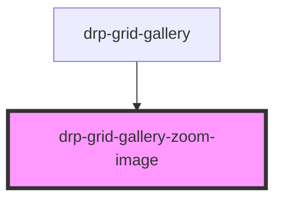

# drp-grid-gallery-image

<!-- Auto Generated Below -->

## Properties

| Property       | Attribute       | Description                   | Type     | Default     |
| -------------- | --------------- | ----------------------------- | -------- | ----------- |
| `height`       | `height`        | Height of the image           | `string` | `undefined` |
| `imageSrc`     | `image-src`     | Source of the image           | `string` | `undefined` |
| `thumbnailSrc` | `thumbnail-src` | Source of the thumbnail image | `string` | `undefined` |
| `width`        | `width`         | Width of the image            | `string` | `undefined` |

## Events

| Event                            | Description               | Type                                 |
| -------------------------------- | ------------------------- | ------------------------------------ |
| `drp-grid-gallery-image-clicked` | When the image is clicked | `CustomEvent<{ imageSrc: string; }>` |

## Dependencies

### Used by

 - [drp-grid-gallery](../drp-grid-gallery)

### Graph

----------------------------------------------

*Built with [StencilJS](https://stenciljs.com/)*
